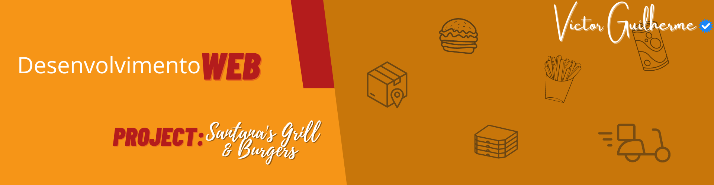
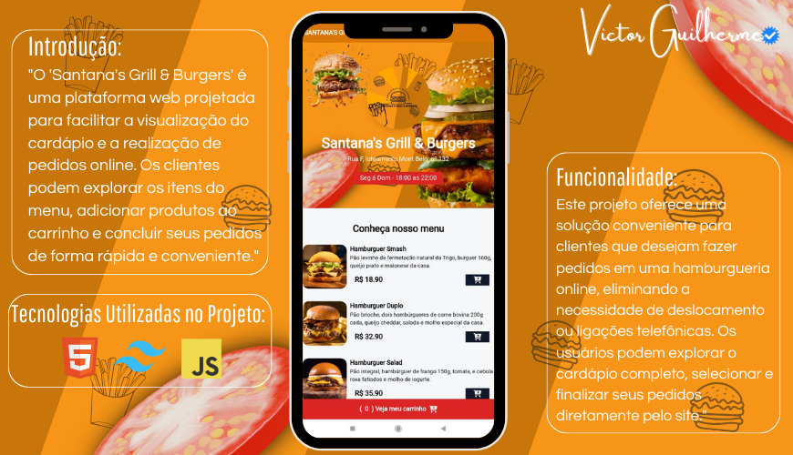
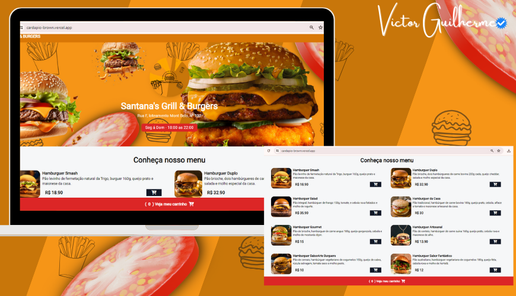

  

O projeto "Santana's Grill & Burgers" é uma aplicação web desenvolvida com o objetivo de proporcionar aos clientes uma experiência simplificada de visualização do cardápio e realização de pedidos online.

  <a href="#-projeto">Projeto</a>&nbsp;&nbsp;&nbsp;|&nbsp;&nbsp;&nbsp;
  <a href="#-projeto">Explicação</a>&nbsp;&nbsp;&nbsp;|&nbsp;&nbsp;&nbsp;
  <a href="#-tecnologias">Tecnologias</a>&nbsp;&nbsp;|&nbsp;&nbsp;&nbsp;
  <a href="#-tecnologias">Autor</a>&nbsp;&nbsp;&nbsp;&nbsp;&nbsp;&nbsp;&nbsp;

 

  
  
  

## 🌐 Projeto
### Intuito e Objetivo:
Este projeto resolve o problema de muitos clientes que desejam fazer pedidos em uma hamburgueria de forma online, sem a necessidade de deslocamento até o estabelecimento ou realização de ligações telefônicas. Com a plataforma, os usuários podem explorar o cardápio detalhado da hamburgueria, selecionar os itens desejados e finalizar seus pedidos diretamente pela web.

 

## 🎯 Explicação 

### Como deve ser usado:
 Para utilizar o projeto, basta acessar o website da hamburgueria "Santana's Grill & Burgers" através de um navegador web. Na página inicial, os usuários poderão visualizar o menu completo, contendo diversas opções de hambúrgueres e bebidas. Para adicionar um item ao carrinho de compras, basta clicar no botão de adição correspondente ao produto desejado. Ao finalizar a seleção dos itens, o usuário pode clicar no botão "Veja meu carrinho", localizado no rodapé da página, para revisar o pedido e proceder com o checkout. Após preencher o endereço de entrega, o usuário pode finalizar o pedido clicando no botão "Finalizar pedido".
 
 

## 🚀 Tecnologias

- HTML: Linguagem de marcação para estruturação do conteúdo da página web.
- Tailwind CSS: Framework CSS utilizado para estilização e design responsivo da interface.
- JavaScript: Linguagem de programação utilizada para adicionar interatividade à aplicação, como a funcionalidade de adicionar itens ao carrinho de compras e finalizar pedidos.
- Toastify.js: Biblioteca JavaScript utilizada para exibir notificações ao usuário, como mensagens de erro ou confirmação.

 

## 👦🏽 Autor

  Victor Guilherme Sodó Santana 

  - https://www.linkedin.com/in/victor-g-15105321a/
